# Unreal Engine Mass 框架详细教学文档（基于 UE 5.5.1 源码）

> 目标：从当前代码库中的 UE C++ 源码出发，系统讲清 Mass 的**原理、源码结构、使用方法、案例实践（含 MassLOD）**，并给出工程化落地建议。  
> 代码基线：`D:\UnrealEngine-5.5.1-release`

---

## 目录

1. [Mass 是什么：先建立整体认知](#mass-是什么先建立整体认知)
2. [源码地图：模块分层与职责](#源码地图模块分层与职责)
3. [核心原理：MassEntity 的数据与执行模型](#核心原理massentity-的数据与执行模型)
4. [核心源码深度解析](#核心源码深度解析)
5. [MassGameplay 关键链路解析](#massgameplay-关键链路解析)
6. [MassAI 与 MassCrowd 扩展解析](#massai-与-masscrowd-扩展解析)
7. [如何使用 Mass：从 0 到可运行](#如何使用-mass从-0-到可运行)
8. [案例 1：最小可用移动体（MassMovement）](#案例-1最小可用移动体massmovement)
9. [案例 2：Crowd + Navigation 行为链路](#案例-2crowd--navigation-行为链路)
10. [案例 3：MassLOD 详细实战（重点）](#案例-3masslod-详细实战重点)
11. [调试、性能与常见坑](#调试性能与常见坑)
12. [学习路径建议](#学习路径建议)
13. [关键源码索引（按主题）](#关键源码索引按主题)
14. [概念图解 + 关键源码（逐节增强版）](#概念图解--关键源码逐节增强版)
15. [按章节可直接复制的代码实操版](#按章节可直接复制的代码实操版)
16. [MassLOD 实操补充（可复制配置）](#masslod-实操补充可复制配置)
17. [一键照抄脚手架（直接复制到项目）](#一键照抄脚手架直接复制到项目)

---

## Mass 是什么：先建立整体认知

Mass 是 UE 的大规模实体模拟框架，核心是**数据导向（Data-Oriented）ECS + Archetype/Chunk 存储 + Processor 调度执行**。

与传统 Actor 主导逻辑相比，Mass 的优势在于：
- 大量实体（NPC、群体、交通、仿真对象）时更容易保持吞吐；
- 数据与逻辑分离（Fragment/Tag 与 Processor 分离）；
- 支持分阶段执行、并行处理、LOD 分层、可变 Tick、复制与表现层解耦。

---

## 源码地图：模块分层与职责

## 1) Core：MassEntity（底层运行时）

- 模块：`Engine\Source\Runtime\MassEntity`
- 关键类：
  - `FMassEntityManager`：实体/Archetype 管理中心  
    文件：`Public\MassEntityManager.h`
  - `FMassEntityQuery`：基于需求筛选 Archetype 并按 Chunk 遍历  
    文件：`Public\MassEntityQuery.h`
  - `UMassProcessor`：处理器抽象（ConfigureQueries/Execute）  
    文件：`Public\MassProcessor.h`
  - `UMassEntitySubsystem`：World 级默认 EntityManager 宿主  
    文件：`Public\MassEntitySubsystem.h`
  - `FMassExecutionContext`：执行期间数据访问与命令缓冲上下文  
    文件：`Public\MassExecutionContext.h`
  - `FMassCommandBuffer`：延迟结构变更命令  
    文件：`Public\MassCommandBuffer.h`

## 2) Gameplay：MassGameplay（功能层）

- 插件定义：`Engine\Plugins\Runtime\MassGameplay\MassGameplay.uplugin`
- 关键模块：
  - `MassSpawner`：模板构建、配置资产、批量生成
  - `MassSimulation`：阶段调度与仿真生命周期
  - `MassMovement`：移动相关 Trait/Processor
  - `MassSignals`：信号系统
  - `MassLOD`：LOD 采集、计算、可变 Tick
  - `MassRepresentation`：可视化表示（Actor/ISM）
  - `MassReplication`：网络复制

## 3) 扩展层：MassAI / MassCrowd

- `Engine\Plugins\AI\MassAI\MassAI.uplugin`
  - `MassNavigation`、`MassZoneGraphNavigation`、`MassAIBehavior`、`MassAIReplication` 等
- `Engine\Plugins\AI\MassCrowd\MassCrowd.uplugin`
  - Crowd 成员、车道跟踪、动态障碍、Crowd 复制/可视化

---

## 核心原理：MassEntity 的数据与执行模型

## 1) 数据模型

- **Entity**：轻量 ID（`FMassEntityHandle`）
- **Fragment**：每实体数据（结构体，SoA 存储）
- **Tag**：无数据标记（用于 Presence 筛选）
- **Shared Fragment / Const Shared Fragment**：同 Archetype 或同配置共享数据
- **Chunk Fragment**：每 Chunk 级共享数据（例如变量 Tick 控制）
- **Archetype**：同一组合（Fragment/Tag/Shared）的实体集合
- **Chunk**：Archetype 内固定批次存储单元（Query 按 Chunk 迭代）

## 2) 执行模型

Processor 执行流程可概括为：

`PhaseManager Tick -> Processor Dispatch -> Query CacheArchetypes -> ForEachEntityChunk -> Fragment 读写 -> Defer 命令回放`

关键点：
- Query 会缓存匹配 Archetype（`CacheArchetypes`）；
- `ForEachEntityChunk` 提供连续批处理；
- 结构变更建议通过 `Context.Defer()`（命令缓冲）延迟提交；
- 并行执行时需要谨慎命令缓冲策略（见后文“坑点”）。

## 3) 生命周期（World 内）

- `UMassEntitySubsystem` 在 World 生命周期中创建并持有默认 `FMassEntityManager`；
- `UMassSimulationSubsystem` 控制是否启动 Mass 仿真，并驱动 Phase Tick；
- 各 Processor 依据 `ExecutionOrder / ProcessingPhase / ExecutionFlags` 参与调度。

---

## 核心源码深度解析

## A. `FMassEntityManager`：实体与 Archetype 的核心

文件：`Engine\Source\Runtime\MassEntity\Public\MassEntityManager.h`

源码注释直接说明了它的职责：
- 托管实体与 Archetype；
- 支持创建实体/Archetype；
- 提供同步 API 与 CommandBuffer 延迟操作；
- 建议通过共享引用管理（`TSharedFromThis`）；
- 手动构建实例时要先 `Initialize()`。

重要能力：
- `CreateArchetype(...)`
- `CreateEntity(...)` / `BatchCreate...`
- `GetArchetypeForEntity(...)`
- `DoEntityCompaction(...)`
- `GetOrMakeCreationContext()`：把多个创建/修改聚合，减少观察者触发次数。

## B. `FMassEntityQuery`：高效批处理入口

文件：`Engine\Source\Runtime\MassEntity\Public\MassEntityQuery.h`

核心接口：
- `ForEachEntityChunk(...)`
- `ParallelForEachEntityChunk(...)`
- `SetChunkFilter(...)`
- `RequireMutatingWorldAccess()`

关键设计点：
- Query 同时继承 Fragment 与 Subsystem Requirement；
- 通过 `ValidArchetypes` + `ArchetypeFragmentMapping` 缓存映射；
- `bAllowParallelCommands` 控制并行 chunk 执行时是否创建独立命令缓冲。

## C. `UMassProcessor`：执行单元契约

文件：`Engine\Source\Runtime\MassEntity\Public\MassProcessor.h`

标准扩展点：
- `ConfigureQueries()`：声明数据需求
- `Execute(...)`：处理逻辑
- `ExecutionOrder / ProcessingPhase / ExecutionFlags`

关键约束：
- 注册的 Query 必须是 Processor 成员变量（`RegisterQuery` 会校验）；
- 可声明 `bRequiresGameThreadExecution`；
- 支持组内顺序（`ExecuteBefore/ExecuteAfter`）与分组执行。

## D. `FMassCommandBuffer`：结构变更安全机制

文件：`Engine\Source\Runtime\MassEntity\Public\MassCommandBuffer.h`

设计目的：避免在遍历过程中直接做结构性修改（如加减 Fragment/Tag）导致数据结构不稳定。  
常见做法：在 Processor 中 `Context.Defer().AddTag/RemoveTag/...`，随后统一回放。

---

## MassGameplay 关键链路解析

## 1) 模板构建：Trait 组合成最终 Template

关键文件：
- `MassSpawner\Public\MassEntityConfigAsset.h`
- `MassSpawner\Private\MassEntityConfigAsset.cpp`
- `MassSpawner\Private\MassEntityTemplateRegistry.cpp`
- `MassSpawner\Private\MassEntityTemplate.cpp`

链路：
1. `FMassEntityConfig` 汇总 Parent + Traits；
2. 每个 Trait 执行 `BuildTemplate(FMassEntityTemplateBuildContext&, World)`；
3. Registry 验证模板（缺失依赖、重复添加、警告/错误）；
4. 最终模板转 Archetype（`MakeFinalTemplate`）。

## 2) 生成：Spawner 批量创建并初始化

关键文件：
- `MassSpawner\Public\MassSpawnerSubsystem.h`
- `MassSpawner\Private\MassSpawnerSubsystem.cpp`

核心行为：
- `SpawnEntities(...)`
- `DoSpawning(...)` 中执行批量创建、批量赋值、可选初始化 Processor；
- `DestroyEntities(...)` 处理销毁。

## 3) 仿真调度：Simulation Subsystem + PhaseManager

关键文件：
- `MassSimulation\Public\MassSimulationSubsystem.h`
- `MassSimulation\Private\MassSimulationSubsystem.cpp`

职责：
- 仿真启动/停止；
- 重建 Tick Pipeline；
- 在各 Phase 触发 Processor 执行。

## 4) Signals：事件驱动的 Processor 触发

关键文件：
- `MassSignals\Public\MassSignalSubsystem.h`
- `MassSignals\Private\MassSignalSubsystem.cpp`

能力：
- `SignalEntity/SignalEntities`
- `DelaySignal...`
- `Signal...Deferred`（通过 `Context.Defer().PushCommand` 异步触发）

适用场景：
- 行为切换、状态机推进、观察事件后跨帧处理。

## 5) Replication：按客户端视角做 LOD 复制

关键文件：
- `MassReplication\Public\MassReplicationProcessor.h`
- `MassReplication\Private\MassReplicationProcessor.cpp`

源码要点：
- Processor 默认在服务端执行（或特定宏条件下全网络模式）；
- `bRequiresGameThreadExecution = true`（可能涉及 UObject/Actor）；
- 先 `SynchronizeClientsAndViewers()`，再收集 Viewer、计算复制 LOD、同步 Bubble 数据。

---

## MassAI 与 MassCrowd 扩展解析

## 1) MassAI

- 插件：`Engine\Plugins\AI\MassAI\MassAI.uplugin`
- 典型内容：
  - `MassNavigation\Public\MassNavigationProcessors.h`
  - `MassAIBehavior\Public\MassStateTreeProcessors.h`
  - `MassAIReplication\Public\MassReplicationPathHandlers.h`

定位：在 MassGameplay 之上增加导航、行为树/StateTree、AI 复制细节。

## 2) MassCrowd

- 插件：`Engine\Plugins\AI\MassCrowd\MassCrowd.uplugin`
- 关键文件：
  - `Public\MassCrowdMemberTrait.h`
  - `Private\MassCrowdMemberTrait.cpp`
  - `Public\MassCrowdNavigationProcessor.h`

典型 Trait 行为（源码可见）：
- `UMassCrowdMemberTrait::BuildTemplate` 中添加 `FMassCrowdTag` 与 `FMassCrowdLaneTrackingFragment`。

---

## 如何使用 Mass：从 0 到可运行

## Step 1：启用插件与模块依赖

通常至少包含：
- `MassEntity`
- `MassSpawner`
- `MassSimulation`
- 根据需求加入 `MassMovement`、`MassSignals`、`MassLOD`、`MassRepresentation`、`MassReplication`、`MassAI`、`MassCrowd`

在模块 `*.Build.cs` 的 `PublicDependencyModuleNames` / `PrivateDependencyModuleNames` 中加入对应模块。

## Step 2：定义数据（Fragment/Tag）

```cpp
USTRUCT()
struct FMyMoveSpeedFragment : public FMassFragment
{
    GENERATED_BODY()
    float Speed = 300.f;
};

USTRUCT()
struct FMyAgentTag : public FMassTag
{
    GENERATED_BODY()
};
```

## Step 3：定义 Trait（把“配置”装配进模板）

继承 `UMassEntityTraitBase`，在 `BuildTemplate` 中添加/要求元素：

```cpp
BuildContext.RequireFragment<FTransformFragment>();
BuildContext.AddFragment<FMyMoveSpeedFragment>();
BuildContext.AddTag<FMyAgentTag>();
```

## Step 4：定义 Processor（声明 Query + 执行）

```cpp
void UMyProcessor::ConfigureQueries()
{
    EntityQuery.AddRequirement<FTransformFragment>(EMassFragmentAccess::ReadWrite);
    EntityQuery.AddRequirement<FMyMoveSpeedFragment>(EMassFragmentAccess::ReadOnly);
}

void UMyProcessor::Execute(FMassEntityManager& EntityManager, FMassExecutionContext& Context)
{
    EntityQuery.ForEachEntityChunk(EntityManager, Context, [](FMassExecutionContext& Context)
    {
        // 读取/写入 Fragment View
    });
}
```

## Step 5：通过 ConfigAsset + Spawner 生成实体

- 使用 `UMassEntityConfigAsset` 组织 Trait；
- `UMassSpawnerSubsystem::SpawnEntities(...)` 批量生成；
- 必要时通过初始化 Processor 做首帧初始化。

## Step 6：需要结构变更时用 Defer

在 Processor 内通过 `Context.Defer()` 添加命令，避免边遍历边改结构导致不一致。

---

## 案例 1：最小可用移动体（MassMovement）

目标：理解“Trait 注入参数 + Processor 每帧更新”。

关键源码：
- `MassMovement\Public\Movement\MassMovementTrait.h`
- `MassMovement\Private\MassMovementTrait.cpp`
- `MassMovement\Public\Movement\MassMovementProcessors.h`
- `MassMovement\Private\MassMovementProcessors.cpp`

链路：
1. `UMassMovementTrait::BuildTemplate` 添加 `FMassVelocityFragment`、`FMassForceFragment`，并注入 `FMassMovementParameters`（ConstShared）。
2. `UMassApplyMovementProcessor` 在 Query 中要求 Velocity/Force/Transform，排除 `FMassOffLODTag`。
3. Execute 中按 DeltaTime 更新速度与位置。

学习重点：
- 为什么移动参数放 ConstShared（同配置共享，减少重复存储）；
- 为什么 OffLOD 要排除（与 LOD 体系协同）。

---

## 案例 2：Crowd + Navigation 行为链路

目标：理解扩展插件如何叠加到核心管线。

关键源码：
- `MassCrowd\Private\MassCrowdMemberTrait.cpp`
- `MassCrowd\Public\MassCrowdNavigationProcessor.h`
- `MassAI\Source\MassNavigation\Public\MassNavigationProcessors.h`

典型流程：
1. Crowd Trait 把实体标记为 Crowd 成员并附加车道追踪数据；
2. Navigation/Crowd Processor 处理车道变更、避障与状态更新；
3. 可配合 Signals/StateTree 形成“感知-决策-执行”闭环。

落地建议：
- 先跑通最小 Crowd 标签与基础车道处理，再逐步增加复杂行为；
- 把“行为状态推进”与“几何更新”拆成不同 Processor，便于调优。

---

## 案例 3：MassLOD 详细实战（重点）

这是本教程新增重点，覆盖你要求的 MassLOD 深入内容。

## 1) 关键源码入口

- `MassLOD\MassLOD.Build.cs`
- `MassLOD\Public\MassLODTrait.h`
- `MassLOD\Public\MassSimulationLOD.h`
- `MassLOD\Public\MassLODTickRateController.h`

## 2) 概念层：Simulation LOD 与 Variable Tick

`MassSimulationLOD.h` 中核心类型：
- `FMassSimulationLODFragment`：记录当前/上次 LOD、最近观察距离；
- `FMassSimulationVariableTickFragment`：记录上次 Tick 时间与累积 Delta；
- `FMassSimulationVariableTickChunkFragment`：Chunk 级 Tick 控制；
- `FMassSimulationLODParameters`：LOD 距离阈值、每档数量上限、是否打 LOD Tag；
- `FMassSimulationVariableTickParameters`：每档 LOD TickRate。

## 3) Trait 注入

`UMassSimulationLODTrait` 在模板构建阶段注入 LOD 参数（含可变 Tick 参数），使实体具备分级更新能力。

## 4) Processor 执行逻辑（高层）

`UMassSimulationLODProcessor` 负责：
1. 收集/使用 Viewer 信息；
2. 计算实体 LOD；
3. 必要时按数量限制调整距离策略；
4. 根据 LOD 更新可变 Tick；
5. 可选地切换 LOD Tag（High/Medium/Low/Off）。

## 5) `TMassLODTickRateController` 机制

文件：`MassLODTickRateController.h`

你可以直接从源码看到它的设计目标：
- 按 Chunk 管理“本帧是否 Tick”；
- 支持首次更新分散（避免峰值）；
- 跟踪 Chunk 修改序号，必要时提前触发更新；
- 在实体 LOD 改变时，推送 Tag 交换命令（`PushSwapTagsCommand`）。

## 6) 实战调参建议

1. 先只开 Simulation LOD，不开变量 Tick，验证行为正确；
2. 再打开变量 Tick，逐步拉开 `TickRates`；
3. 设置 `LODDistance[]` 时结合相机高度、场景尺度；
4. `LODMaxCount[]` 先给保守值，观察帧耗与行为质量；
5. 关注 OffLOD 实体是否仍被误处理（Query 是否正确排除）。

---

## 调试、性能与常见坑

## 1) 常见坑

1. **Query 不是成员变量**  
   `UMassProcessor::RegisterQuery` 有校验，错误会直接触发断言/检查。

2. **并行 Query 时错误关闭命令缓冲**  
   `FMassEntityQuery` 注释明确：并行执行若仍发命令却禁用并行命令缓冲，可能崩溃。

3. **处理过程中注册/注销动态 Processor**  
   `UMassSimulationSubsystem` 限制在 Mass 处理期间修改动态 Processor。

4. **处理期间直接销毁实体**  
   `UMassSpawnerSubsystem::DestroyEntities` 对处理期间调用有检查约束。

5. **Trait 依赖假设过强**  
   `BuildFromTraits` + 验证逻辑提醒：不要假设 Trait 顺序可控，依赖要显式表达。

## 2) 性能建议

- 尽量让 Query 按 Chunk 做纯数据计算；
- 参数共享化（ConstShared）优先于重复 per-entity 存储；
- 把“重逻辑”拆分到更合适 Phase 或条件执行；
- 配合 MassLOD 做“质量/性能分层”；
- 对复制与表现层分别做 LOD，不要把两者耦合成单一开关。

## 3) 调试建议

- 使用 Mass Debugger / 编辑器相关调试模块（如 `MassEntityDebugger`）；
- 打开日志观察 Trait 验证、缺失依赖、重复元素；
- 对关键 Processor 增加统计与分阶段耗时监控。

---

## 学习路径建议

推荐按以下顺序学习并实践：

1. **MassEntity 基础**：EntityManager + Query + Processor
2. **Spawner 模板链路**：Trait -> Template -> Spawn
3. **Movement 最小示例**：先跑通单一行为
4. **Signals/State 驱动**：让行为可事件化推进
5. **MassLOD**：学会把性能做成系统能力
6. **Representation/Replication**：补齐表现与网络侧
7. **MassAI/MassCrowd**：进入复杂群体行为

---

## 关键源码索引（按主题）

## 核心（MassEntity）
- `Engine\Source\Runtime\MassEntity\MassEntity.Build.cs`
- `Engine\Source\Runtime\MassEntity\Public\MassEntityManager.h`
- `Engine\Source\Runtime\MassEntity\Public\MassEntityQuery.h`
- `Engine\Source\Runtime\MassEntity\Public\MassProcessor.h`
- `Engine\Source\Runtime\MassEntity\Public\MassExecutionContext.h`
- `Engine\Source\Runtime\MassEntity\Public\MassCommandBuffer.h`
- `Engine\Source\Runtime\MassEntity\Public\MassEntitySubsystem.h`

## 模板与生成（MassSpawner）
- `Engine\Plugins\Runtime\MassGameplay\Source\MassSpawner\Public\MassEntityConfigAsset.h`
- `Engine\Plugins\Runtime\MassGameplay\Source\MassSpawner\Private\MassEntityConfigAsset.cpp`
- `Engine\Plugins\Runtime\MassGameplay\Source\MassSpawner\Private\MassEntityTemplateRegistry.cpp`
- `Engine\Plugins\Runtime\MassGameplay\Source\MassSpawner\Public\MassSpawnerSubsystem.h`
- `Engine\Plugins\Runtime\MassGameplay\Source\MassSpawner\Private\MassSpawnerSubsystem.cpp`

## 仿真与移动
- `Engine\Plugins\Runtime\MassGameplay\Source\MassSimulation\Public\MassSimulationSubsystem.h`
- `Engine\Plugins\Runtime\MassGameplay\Source\MassSimulation\Private\MassSimulationSubsystem.cpp`
- `Engine\Plugins\Runtime\MassGameplay\Source\MassMovement\Public\Movement\MassMovementTrait.h`
- `Engine\Plugins\Runtime\MassGameplay\Source\MassMovement\Private\MassMovementTrait.cpp`
- `Engine\Plugins\Runtime\MassGameplay\Source\MassMovement\Public\Movement\MassMovementProcessors.h`
- `Engine\Plugins\Runtime\MassGameplay\Source\MassMovement\Private\MassMovementProcessors.cpp`

## Signals / LOD / 表现 / 复制
- `Engine\Plugins\Runtime\MassGameplay\Source\MassSignals\Public\MassSignalSubsystem.h`
- `Engine\Plugins\Runtime\MassGameplay\Source\MassSignals\Private\MassSignalSubsystem.cpp`
- `Engine\Plugins\Runtime\MassGameplay\Source\MassLOD\Public\MassLODTrait.h`
- `Engine\Plugins\Runtime\MassGameplay\Source\MassLOD\Public\MassSimulationLOD.h`
- `Engine\Plugins\Runtime\MassGameplay\Source\MassLOD\Public\MassLODTickRateController.h`
- `Engine\Plugins\Runtime\MassGameplay\Source\MassRepresentation\Public\MassRepresentationSubsystem.h`
- `Engine\Plugins\Runtime\MassGameplay\Source\MassReplication\Public\MassReplicationProcessor.h`
- `Engine\Plugins\Runtime\MassGameplay\Source\MassReplication\Private\MassReplicationProcessor.cpp`

## AI / Crowd
- `Engine\Plugins\AI\MassAI\MassAI.uplugin`
- `Engine\Plugins\AI\MassAI\Source\MassNavigation\Public\MassNavigationProcessors.h`
- `Engine\Plugins\AI\MassCrowd\MassCrowd.uplugin`
- `Engine\Plugins\AI\MassCrowd\Source\MassCrowd\Public\MassCrowdMemberTrait.h`
- `Engine\Plugins\AI\MassCrowd\Source\MassCrowd\Private\MassCrowdMemberTrait.cpp`
- `Engine\Plugins\AI\MassCrowd\Source\MassCrowd\Public\MassCrowdNavigationProcessor.h`

---

## 概念图解 + 关键源码（逐节增强版）

> 本节升级为 **Mermaid 流程图/时序图 + 讲课版式**。  
> 每个小节统一采用：**讲课目标 -> Mermaid 图 -> 关键源码 -> 讲课话术 -> 课堂提问**。

## 1) 数据模型（对应前文“数据模型”小节）

### 讲课目标
- 让学员理解为什么 Mass 的存储模型更适合大规模实体。

### Mermaid 图（流程图）
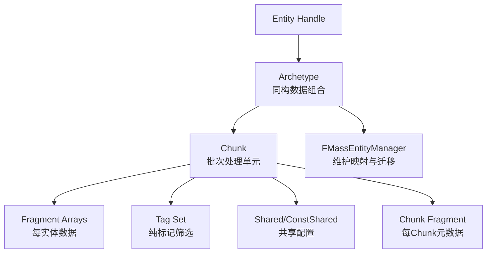

### 关键源码（`MassEntityManager.h` 注释）

```cpp
// Engine\Source\Runtime\MassEntity\Public\MassEntityManager.h
// L38+
// The type responsible for hosting Entities managing Archetypes.
// Entities are stored as FEntityData entries in a chunked array.
// Each valid entity is assigned to an Archetype ...
```

### 讲课话术
Mass 不是“面向对象逐个处理”，而是“同类数据打包批处理”；这就是高并发/高密度场景里它能抗压的核心原因。

### 课堂提问
- 如果把共享参数放到每个实体 Fragment，会带来什么内存与缓存成本？

## 2) 执行模型（对应前文“执行模型”小节）

### 讲课目标
- 让学员掌握 Processor 一帧中的标准执行路径。

### Mermaid 图（流程图）
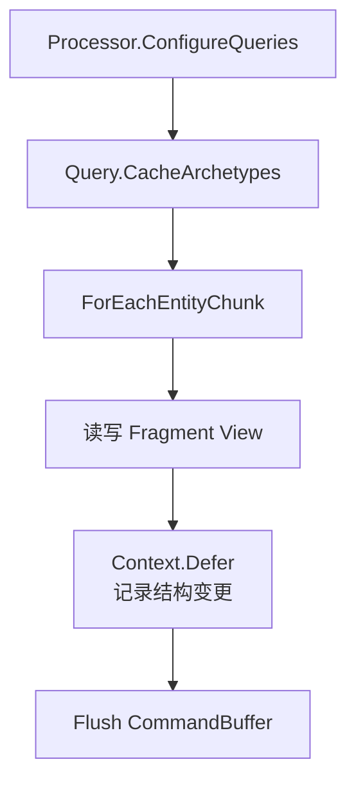

### 关键源码 1（Query 语义）

```cpp
// Engine\Source\Runtime\MassEntity\Public\MassEntityQuery.h
// L45+
void ForEachEntityChunk(FMassEntityManager& EntityManager,
    FMassExecutionContext& ExecutionContext,
    const FMassExecuteFunction& ExecuteFunction);
```

### 关键源码 2（Processor 要求）

```cpp
// Engine\Source\Runtime\MassEntity\Public\MassProcessor.h
// L93+
// Query is required to be a member variable of this processor.
void RegisterQuery(FMassEntityQuery& Query);
```

### 讲课话术
先筛选“哪些桶需要处理”，再做 chunk 内向量化/批量循环，最后把结构变更延迟到安全时机提交。

### 课堂提问
- 为什么 `RegisterQuery` 要求 Query 必须是 Processor 成员变量？

## 3) 结构变更安全（对应前文“CommandBuffer”小节）

### 讲课目标
- 让学员理解“为什么不能边遍历边改结构”。

### Mermaid 图（时序图）
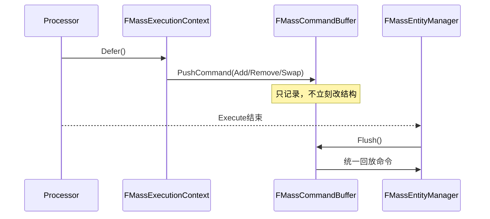

### 关键源码（线程与时机保护）

```cpp
// Engine\Source\Runtime\MassEntity\Public\MassCommandBuffer.h
// L14+
#define COMMAND_PUSHING_CHECK() \
checkf(IsFlushing() == false, ...); \
checkf(OwnerThreadId == FPlatformTLS::GetCurrentThreadId(), ...);
```

### 讲课话术
CommandBuffer 是“结构安全闸门”：它明确限制了错误时机和错误线程，避免结构破坏。

### 课堂提问
- 如果在 Flush 中继续 Push 命令，会破坏什么执行假设？

## 4) Trait -> Template 构建（对应前文“模板构建”小节）

### 讲课目标
- 让学员理解配置资产如何“编译”为最终实体模板。

### Mermaid 图（时序图）
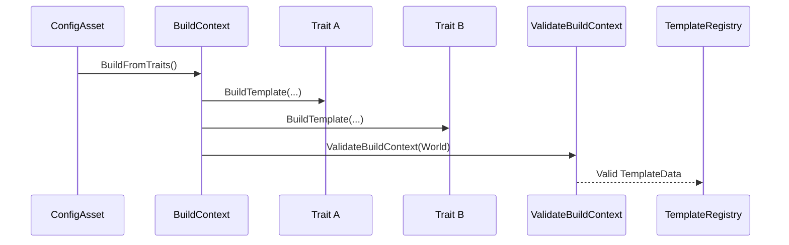

### 关键源码（逐 Trait 执行）

```cpp
// Engine\Plugins\Runtime\MassGameplay\Source\MassSpawner\Private\MassEntityTemplateRegistry.cpp
// L108+
for (const UMassEntityTraitBase* Trait : Traits)
{
    if (SetTraitBeingProcessed(Trait))
    {
        Trait->BuildTemplate(*this, World);
    }
}
const bool bTemplateValid = ValidateBuildContext(World);
```

### 讲课话术
Trait 就像“能力积木”，BuildContext 负责拼装，Validator 负责兜底，Registry 负责产出可复用模板。

### 课堂提问
- 为什么模板构建后还要做一次统一验证，而不是在每个 Trait 内各自保证？

## 5) Spawner 批量生成（对应前文“生成”小节）

### 讲课目标
- 让学员掌握“批量创建 + 批量初始化”的标准生成链路。

### Mermaid 图（流程图）
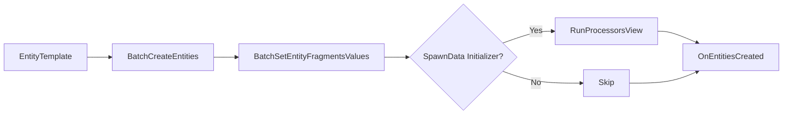

### 关键源码

```cpp
// Engine\Plugins\Runtime\MassGameplay\Source\MassSpawner\Private\MassSpawnerSubsystem.cpp
// L130+
TSharedRef<FMassEntityManager::FEntityCreationContext> CreationContext
    = EntityManager->BatchCreateEntities(...);
EntityManager->BatchSetEntityFragmentsValues(...);
UE::Mass::Executor::RunProcessorsView(...); // optional initializer
```

### 讲课话术
把创建和初始化拆成批处理步骤，是 Mass 能在高数量生成时保持稳定吞吐的关键。

### 课堂提问
- 为什么 `DestroyEntities` 在 processing 期间会被判定为危险操作？

## 6) Signal 事件驱动（对应前文“Signals”小节）

### 讲课目标
- 让学员掌握 Deferred Signal 的安全触发模型。

### Mermaid 图（时序图）
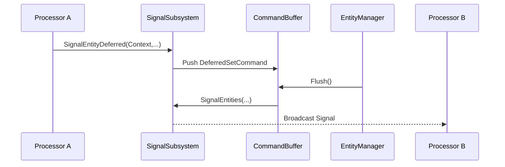

### 关键源码

```cpp
// Engine\Plugins\Runtime\MassGameplay\Source\MassSignals\Private\MassSignalSubsystem.cpp
// L96+
Context.Defer().PushCommand<FMassDeferredSetCommand>(
    [SignalName, InEntities = TArray<FMassEntityHandle>(Entities)](const FMassEntityManager& System)
{
    UMassSignalSubsystem* SignalSubsystem = UWorld::GetSubsystem<UMassSignalSubsystem>(System.GetWorld());
    SignalSubsystem->SignalEntities(SignalName, InEntities);
});
```

### 讲课话术
事件不是“立刻打断流程”，而是和结构变更一样走安全通道，在正确时机广播。

### 课堂提问
- 什么场景适合 `DelaySignalEntitiesDeferred` 而不是立即 Signal？

## 7) Movement 实例（对应“案例 1”）

### 讲课目标
- 用最经典的 Movement 案例串起 Trait + Processor 协作关系。

### Mermaid 图（流程图）
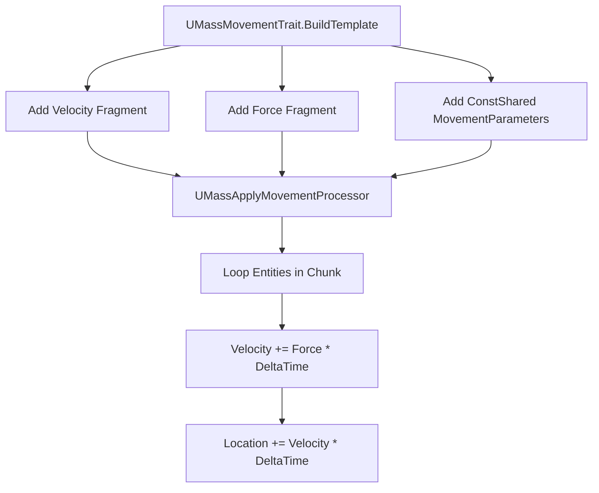

### 关键源码 A（Trait）

```cpp
// MassMovementTrait.cpp
BuildContext.AddFragment<FMassVelocityFragment>();
BuildContext.AddFragment<FMassForceFragment>();
BuildContext.AddConstSharedFragment(MovementFragment);
```

### 关键源码 B（Processor）

```cpp
// MassMovementProcessors.cpp
EntityQuery.AddTagRequirement<FMassOffLODTag>(EMassFragmentPresence::None);
...
Velocity.Value += Force.Value * DeltaTime;
CurrentLocation += Velocity.Value * DeltaTime;
```

### 讲课话术
把“状态配置”放 Trait，把“高频推进”放 Processor，这是 Mass 的标准分工。

### 课堂提问
- 为什么 Query 要排除 `FMassOffLODTag`？

## 8) Replication 视角（对应前文“Replication”小节）

### 讲课目标
- 理解复制链路为什么强依赖 LOD 和客户端视角。

### Mermaid 图（时序图）
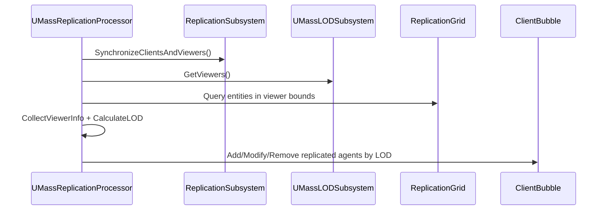

### 关键源码

```cpp
// MassReplicationProcessor.cpp
ProcessingPhase = EMassProcessingPhase::PostPhysics;
bRequiresGameThreadExecution = true;
...
CollectViewerInfoQuery.AddRequirement<FTransformFragment>(EMassFragmentAccess::ReadOnly);
CalculateLODQuery.AddRequirement<FMassReplicationLODFragment>(EMassFragmentAccess::ReadWrite);
```

### 讲课话术
复制是“按客户端预算分配带宽”：近处高频、远处降频、不可见可剔除。

### 课堂提问
- 为什么复制 Processor 里会设置 `bRequiresGameThreadExecution = true`？

## 9) Crowd 扩展最小点（对应前文“MassCrowd”小节）

### 讲课目标
- 让学员理解扩展插件如何在核心 ECS 上“加能力”。

### Mermaid 图（流程图）
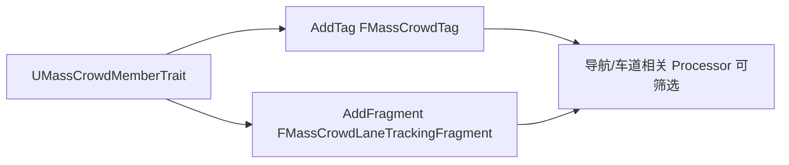

### 关键源码

```cpp
// Engine\Plugins\AI\MassCrowd\Source\MassCrowd\Private\MassCrowdMemberTrait.cpp
BuildContext.AddTag<FMassCrowdTag>();
BuildContext.AddFragment<FMassCrowdLaneTrackingFragment>();
```

### 讲课话术
Crowd 不是“重写一套系统”，而是在核心数据流上增量叠加领域语义。

### 课堂提问
- 你会把“群体状态”放 Tag 还是 Fragment？为什么？

## 10) MassLOD 与 Variable Tick（对应“案例 3”）

### 讲课目标
- 让学员掌握 MassLOD 的两个核心收益：降处理量、稳帧时间。

### Mermaid 图 A（流程图）
```mermaid
flowchart TD
    V[Viewer Info] --> C[LOD Collector]
    C --> L[LOD Calculator<br/>High/Medium/Low/Off]
    L --> Tag[Set LOD Tag(optional)]
    L --> Tick[Variable Tick Controller]
    Tick --> Chunk[Chunk ShouldTickThisFrame]
    Chunk --> Proc[Processors skip or execute this frame]
```

### Mermaid 图 B（时序图）
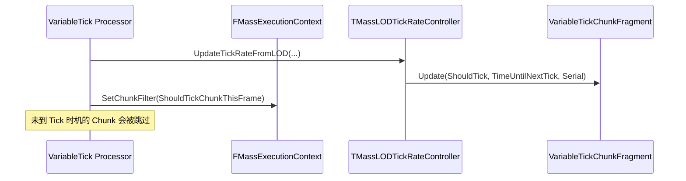

### 关键源码 A（Chunk 过滤）

```cpp
// MassSimulationLOD.h
static bool ShouldTickChunkThisFrame(const FMassExecutionContext& Context)
{
    const FMassSimulationVariableTickChunkFragment* ChunkFragment =
        Context.GetChunkFragmentPtr<FMassSimulationVariableTickChunkFragment>();
    return ChunkFragment == nullptr || ChunkFragment->ShouldTickThisFrame();
}
```

### 关键源码 B（TickRate 核心）

```cpp
// MassLODTickRateController.h
const float TickRate = TickRates[ChunkLOD];
...
bShouldTickThisFrame = TimeUntilNextTick <= 0.0f || LastChunkSerialModificationNumber != NewChunkSerialModificationNumber;
ChunkData.Update(bShouldTickThisFrame, TimeUntilNextTick, NewChunkSerialModificationNumber);
```

### 讲课话术
在 Mass 里，LOD 的核心价值不是视觉，而是“谁今天不用算、少算几次、多久再算一次”。

### 课堂提问
- 如果你把 Low/Off 的 TickRate 设得过小（太频繁），会发生什么？

## 11) 生命周期全景图（补充）

### 讲课目标
- 帮学员把各子系统放进一张“世界生命周期”全景图。

### Mermaid 图（流程图）
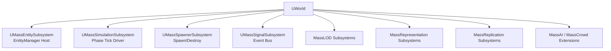

### 讲课话术
先把“谁管数据、谁驱动 Tick、谁做生成、谁发事件”讲清楚，再进入每个模块细节，学生吸收效率会高很多。

### 课堂提问
- 你现在项目里遇到的瓶颈更像是“生成瓶颈”“每帧计算瓶颈”还是“复制瓶颈”？

---

## 按章节可直接复制的代码实操版

> 说明：本节是“可落地模板”，你可以直接复制到项目中，再按你的业务命名调整。  
> 示例假设你创建了一个模块：`MassPractice`。

## 第 1 章：模块依赖（Build.cs）

文件：`Source\MassPractice\MassPractice.Build.cs`

```csharp
using UnrealBuildTool;

public class MassPractice : ModuleRules
{
    public MassPractice(ReadOnlyTargetRules Target) : base(Target)
    {
        PCHUsage = PCHUsageMode.UseExplicitOrSharedPCHs;

        PublicDependencyModuleNames.AddRange(new string[]
        {
            "Core",
            "CoreUObject",
            "Engine",
            "MassEntity",
            "MassCommon",
            "MassSpawner",
            "MassSimulation",
            "MassMovement",
            "MassSignals",
            "MassLOD"
        });
    }
}
```

## 第 2 章：定义 Fragment 与 Tag

文件：`Source\MassPractice\Public\MassPracticeFragments.h`

```cpp
#pragma once

#include "CoreMinimal.h"
#include "MassEntityTypes.h"
#include "MassPracticeFragments.generated.h"

USTRUCT()
struct FMassPracticeMoveSpeedFragment : public FMassFragment
{
    GENERATED_BODY()

    UPROPERTY(EditAnywhere)
    float Speed = 300.f;
};

USTRUCT()
struct FMassPracticeAgentTag : public FMassTag
{
    GENERATED_BODY()
};
```

## 第 3 章：定义 Trait（BuildTemplate）

文件：`Source\MassPractice\Public\MassPracticeTrait.h`

```cpp
#pragma once

#include "MassEntityTraitBase.h"
#include "MassPracticeTrait.generated.h"

UCLASS(meta = (DisplayName = "MassPractice Trait"))
class MASSPRACTICE_API UMassPracticeTrait : public UMassEntityTraitBase
{
    GENERATED_BODY()

protected:
    virtual void BuildTemplate(FMassEntityTemplateBuildContext& BuildContext, const UWorld& World) const override;
};
```

文件：`Source\MassPractice\Private\MassPracticeTrait.cpp`

```cpp
#include "MassPracticeTrait.h"
#include "MassEntityTemplateRegistry.h"
#include "MassCommonFragments.h"
#include "MassPracticeFragments.h"

void UMassPracticeTrait::BuildTemplate(FMassEntityTemplateBuildContext& BuildContext, const UWorld& World) const
{
    BuildContext.RequireFragment<FTransformFragment>();
    BuildContext.AddFragment<FMassPracticeMoveSpeedFragment>();
    BuildContext.AddTag<FMassPracticeAgentTag>();
}
```

## 第 4 章：定义 Processor（ConfigureQueries + Execute）

文件：`Source\MassPractice\Public\MassPracticeProcessor.h`

```cpp
#pragma once

#include "MassProcessor.h"
#include "MassEntityQuery.h"
#include "MassPracticeProcessor.generated.h"

UCLASS()
class MASSPRACTICE_API UMassPracticeProcessor : public UMassProcessor
{
    GENERATED_BODY()

public:
    UMassPracticeProcessor();

protected:
    virtual void ConfigureQueries() override;
    virtual void Execute(FMassEntityManager& EntityManager, FMassExecutionContext& Context) override;

    FMassEntityQuery EntityQuery;
};
```

文件：`Source\MassPractice\Private\MassPracticeProcessor.cpp`

```cpp
#include "MassPracticeProcessor.h"
#include "MassCommonFragments.h"
#include "MassExecutionContext.h"
#include "MassPracticeFragments.h"

UMassPracticeProcessor::UMassPracticeProcessor()
    : EntityQuery(*this)
{
    ExecutionFlags = (int32)EProcessorExecutionFlags::AllNetModes;
    bAutoRegisterWithProcessingPhases = true;
}

void UMassPracticeProcessor::ConfigureQueries()
{
    EntityQuery.AddRequirement<FTransformFragment>(EMassFragmentAccess::ReadWrite);
    EntityQuery.AddRequirement<FMassPracticeMoveSpeedFragment>(EMassFragmentAccess::ReadOnly);
    EntityQuery.AddTagRequirement<FMassPracticeAgentTag>(EMassFragmentPresence::All);
}

void UMassPracticeProcessor::Execute(FMassEntityManager& EntityManager, FMassExecutionContext& Context)
{
    EntityQuery.ForEachEntityChunk(EntityManager, Context, [](FMassExecutionContext& Context)
    {
        const float DeltaTime = Context.GetDeltaTimeSeconds();
        const TArrayView<FTransformFragment> Transforms = Context.GetMutableFragmentView<FTransformFragment>();
        const TConstArrayView<FMassPracticeMoveSpeedFragment> Speeds = Context.GetFragmentView<FMassPracticeMoveSpeedFragment>();

        for (int32 EntityIndex = 0; EntityIndex < Context.GetNumEntities(); ++EntityIndex)
        {
            FTransform& Transform = Transforms[EntityIndex].GetMutableTransform();
            const FVector Forward = Transform.GetRotation().GetForwardVector();
            Transform.AddToTranslation(Forward * Speeds[EntityIndex].Speed * DeltaTime);
        }
    });
}
```

## 第 5 章：在代码中生成实体（SpawnerSubsystem）

文件：`Source\MassPractice\Public\MassPracticeSpawnerActor.h`

```cpp
#pragma once

#include "CoreMinimal.h"
#include "GameFramework/Actor.h"
#include "MassEntityConfigAsset.h"
#include "MassPracticeSpawnerActor.generated.h"

UCLASS()
class MASSPRACTICE_API AMassPracticeSpawnerActor : public AActor
{
    GENERATED_BODY()

public:
    UPROPERTY(EditAnywhere, Category = "MassPractice")
    TObjectPtr<UMassEntityConfigAsset> EntityConfig = nullptr;

    UPROPERTY(EditAnywhere, Category = "MassPractice", meta = (ClampMin = "1"))
    int32 SpawnCount = 100;

protected:
    virtual void BeginPlay() override;
};
```

文件：`Source\MassPractice\Private\MassPracticeSpawnerActor.cpp`

```cpp
#include "MassPracticeSpawnerActor.h"
#include "MassSpawnerSubsystem.h"

void AMassPracticeSpawnerActor::BeginPlay()
{
    Super::BeginPlay();

    UWorld* World = GetWorld();
    if (!World || !EntityConfig)
    {
        return;
    }

    UMassSpawnerSubsystem* SpawnerSubsystem = World->GetSubsystem<UMassSpawnerSubsystem>();
    if (!SpawnerSubsystem)
    {
        return;
    }

    const FMassEntityTemplate& Template = EntityConfig->GetOrCreateEntityTemplate(*World);

    TArray<FMassEntityHandle> SpawnedEntities;
    SpawnerSubsystem->SpawnEntities(Template, (uint32)SpawnCount, SpawnedEntities);
}
```

## 第 6 章：Signal 驱动模板（可复制）

文件：`Source\MassPractice\Private\MassPracticeSignalHelpers.h`

```cpp
#pragma once

#include "MassSignalSubsystem.h"
#include "MassExecutionContext.h"

namespace UE::MassPractice
{
    static const FName StartMovingSignal(TEXT("MassPractice.StartMoving"));

    inline void RaiseDeferredStartSignal(FMassExecutionContext& Context, const FMassEntityHandle Entity)
    {
        // 需要在 Processor 的 ConfigureQueries() 中声明：
        // ProcessorRequirements.AddSubsystemRequirement<UMassSignalSubsystem>(EMassFragmentAccess::ReadWrite);
        UMassSignalSubsystem& SignalSubsystem = Context.GetMutableSubsystemChecked<UMassSignalSubsystem>();
        SignalSubsystem.SignalEntityDeferred(Context, StartMovingSignal, Entity);
    }
}
```

## 第 7 章：变量 Tick 友好的 Processor 模板（可复制）

文件：`Source\MassPractice\Public\MassPracticeVariableTickProcessor.h`

```cpp
#pragma once

#include "MassProcessor.h"
#include "MassEntityQuery.h"
#include "MassPracticeVariableTickProcessor.generated.h"

UCLASS()
class MASSPRACTICE_API UMassPracticeVariableTickProcessor : public UMassProcessor
{
    GENERATED_BODY()

public:
    UMassPracticeVariableTickProcessor();

protected:
    virtual void ConfigureQueries() override;
    virtual void Execute(FMassEntityManager& EntityManager, FMassExecutionContext& Context) override;

    FMassEntityQuery EntityQuery;
};
```

文件：`Source\MassPractice\Private\MassPracticeVariableTickProcessor.cpp`

```cpp
#include "MassPracticeVariableTickProcessor.h"
#include "MassCommonFragments.h"
#include "MassExecutionContext.h"
#include "MassPracticeFragments.h"
#include "MassSimulationLOD.h"

UMassPracticeVariableTickProcessor::UMassPracticeVariableTickProcessor()
    : EntityQuery(*this)
{
    ExecutionFlags = (int32)EProcessorExecutionFlags::AllNetModes;
    bAutoRegisterWithProcessingPhases = true;
}

void UMassPracticeVariableTickProcessor::ConfigureQueries()
{
    EntityQuery.AddRequirement<FTransformFragment>(EMassFragmentAccess::ReadWrite);
    EntityQuery.AddRequirement<FMassPracticeMoveSpeedFragment>(EMassFragmentAccess::ReadOnly);
    EntityQuery.AddTagRequirement<FMassPracticeAgentTag>(EMassFragmentPresence::All);

    EntityQuery.AddRequirement<FMassSimulationVariableTickFragment>(EMassFragmentAccess::ReadOnly, EMassFragmentPresence::Optional);
    EntityQuery.AddChunkRequirement<FMassSimulationVariableTickChunkFragment>(EMassFragmentAccess::ReadOnly, EMassFragmentPresence::Optional);
    EntityQuery.SetChunkFilter(&FMassSimulationVariableTickChunkFragment::ShouldTickChunkThisFrame);
}

void UMassPracticeVariableTickProcessor::Execute(FMassEntityManager& EntityManager, FMassExecutionContext& Context)
{
    EntityQuery.ForEachEntityChunk(EntityManager, Context, [](FMassExecutionContext& Context)
    {
        const TArrayView<FTransformFragment> Transforms = Context.GetMutableFragmentView<FTransformFragment>();
        const TConstArrayView<FMassPracticeMoveSpeedFragment> Speeds = Context.GetFragmentView<FMassPracticeMoveSpeedFragment>();
        const TConstArrayView<FMassSimulationVariableTickFragment> SimTickList = Context.GetFragmentView<FMassSimulationVariableTickFragment>();

        const bool bHasVariableTick = (SimTickList.Num() > 0);
        const float WorldDeltaTime = Context.GetDeltaTimeSeconds();

        for (int32 EntityIndex = 0; EntityIndex < Context.GetNumEntities(); ++EntityIndex)
        {
            const float DeltaTime = bHasVariableTick ? SimTickList[EntityIndex].DeltaTime : WorldDeltaTime;
            FTransform& Transform = Transforms[EntityIndex].GetMutableTransform();
            const FVector Forward = Transform.GetRotation().GetForwardVector();
            Transform.AddToTranslation(Forward * Speeds[EntityIndex].Speed * DeltaTime);
        }
    });
}
```

## 第 8 章：最小验证清单（每章共用）

1. 模块编译通过（Build.cs 无缺失依赖）。  
2. Trait 被成功添加到 `UMassEntityConfigAsset`。  
3. Processor 出现在 Mass 执行管线中（可通过日志或调试工具确认）。  
4. 生成数量与预期一致（Spawner 输出实体数正确）。  
5. 打开 LOD 后，OffLOD 与变量 Tick 行为符合预期。

---

## MassLOD 实操补充（可复制配置）

## 1) 配置资产中必须加的 Trait 组合

在 `UMassEntityConfigAsset` 中添加（编辑器中）：
- `UMassDistanceLODCollectorTrait`
- `UMassSimulationLODTrait`

这两者组合后，才会有“距离采集 + Simulation LOD + 可变 Tick”完整链路。

## 2) 可直接复制的配置模板（建议值）

> 下列数值用于“先跑通再调优”，不是唯一最优解。

```text
LODDistance:
  High   = 1500
  Medium = 3500
  Low    = 7000
  Off    = 12000

LODMaxCount:
  High   = 1000
  Medium = 3000
  Low    = 10000
  Off    = 1000000

TickRates (Variable Tick):
  High   = 0.0
  Medium = 0.033
  Low    = 0.10
  Off    = 0.50
```

## 3) MassLOD 接入后必须做的三项检查

1. **Query 是否正确过滤 OffLOD**：例如移动 Processor 不应继续更新 OffLOD 实体。  
2. **变量 Tick DeltaTime 使用是否正确**：有 `FMassSimulationVariableTickFragment` 时优先用 `DeltaTime`。  
3. **Chunk Filter 是否生效**：`ShouldTickChunkThisFrame` 必须真正参与查询过滤。

## 4) 与复制/表现层协同建议

- Simulation LOD（逻辑）与 Representation/Replication LOD（视觉/网络）要分开调；  
- 先保逻辑正确，再压视觉与网络开销；  
- 调优顺序建议：`距离阈值 -> 数量上限 -> TickRates`。

---

## 一键照抄脚手架（直接复制到项目）

本仓库已准备完整脚手架目录：

- `MassPracticeScaffold\Plugins\MassPractice\...`（完整插件代码）
- `MassPracticeScaffold\OneClick-Install.ps1`（一键安装脚本）

### 使用方式（PowerShell）

```powershell
cd <当前仓库根目录>\MassPracticeScaffold
.\OneClick-Install.ps1 -ProjectRoot "D:\YourUEProject"
```

执行后会把插件复制到：

`D:\YourUEProject\Plugins\MassPractice`

### 脚手架目录树

```text
MassPracticeScaffold
├─ OneClick-Install.ps1
└─ Plugins
   └─ MassPractice
      ├─ MassPractice.uplugin
      └─ Source
         └─ MassPractice
            ├─ MassPractice.Build.cs
            ├─ Public
            │  ├─ MassPracticeModule.h
            │  ├─ MassPracticeFragments.h
            │  ├─ MassPracticeTrait.h
            │  ├─ MassPracticeProcessor.h
            │  ├─ MassPracticeVariableTickProcessor.h
            │  ├─ MassPracticeSpawnerActor.h
            │  └─ MassPracticeSignalHelpers.h
            └─ Private
               ├─ MassPracticeModule.cpp
               ├─ MassPracticeTrait.cpp
               ├─ MassPracticeProcessor.cpp
               ├─ MassPracticeVariableTickProcessor.cpp
               └─ MassPracticeSpawnerActor.cpp
```

### 安装后最短落地步骤

1. 重新生成项目文件并编译。  
2. 在编辑器确认插件 `MassPractice` 启用。  
3. 创建 `Mass Entity Config Asset` 并添加 `MassPractice Trait`。  
4. （可选）添加 `DistanceLODCollector` + `SimulationLOD` Trait 测试变量 Tick。  
5. 场景中放置 `AMassPracticeSpawnerActor` 并指定 Config，即可开始验证。

---

## 结语

如果你接下来要把这份文档进一步升级为“课程级教材”，建议下一步补两类内容：
1. 每章增加“最小可运行工程片段”（可复制到项目直接运行）；
2. 增加“调参实验表”（LOD 距离/TickRate/数量阈值对帧耗与效果的影响）。

这样就能从“读源码理解”进一步走到“可操作、可验证、可调优”的工程实践闭环。
